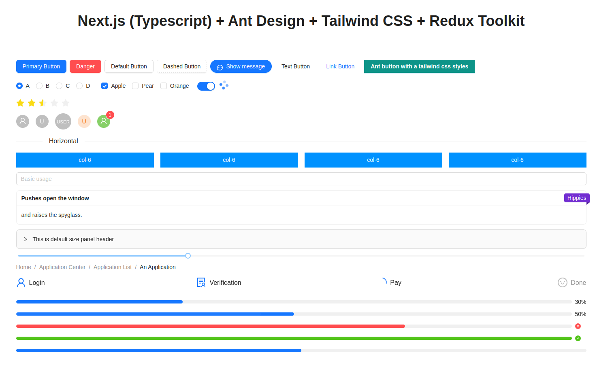

<h1 align="center" style="font-size: 30px">Next.js 13 (Typescript) + Ant Design + Tailwind CSS + Redux Toolkit</h1>

<p align="center">
  
</p>

### Getting started

Khuyến khích nên sử dụng VSCode để code (vì đã được config các extendsion, setting hỗ trợ format code và check các rule của eslint) và nên cài thêm một số extensions sau:

- [Prettier](https://marketplace.visualstudio.com/items?itemName=esbenp.prettier-vscode) => Check format code
- [ESLint](https://marketplace.visualstudio.com/items?itemName=dbaeumer.vscode-eslint) => Check rule code
- [Code Spell Checker](https://marketplace.visualstudio.com/items?itemName=streetsidesoftware.code-spell-checker) => Kiểm tra lỗi chính tả
- [Tailwind CSS IntelliSense](https://marketplace.visualstudio.com/items?itemName=bradlc.vscode-tailwindcss) => Gợi ý các class của Tailwind CSS

Một số thư viện sử dụng trong project:

- [Ant Design](https://ant.design) => Thư viện UI
- [Redux Toolkit](https://redux-toolkit.js.org) => Redux cải tiến so với redux core, giúp viết code redux ngắn gọn hơn
- [Tailwind CSS](https://tailwindcss.com/) => Framework CSS

### Setup

```
git clone https://github.com/quocvn/nextjs-base-core.git
cd nextjs-base-core
npm install or yarn install
```

### Run local (http://localhost:9999):

```bash
npm run dev or yarn run dev
```

Khi run thành công


### Check format code và eslint

Mục đích để kiểm tra format code và có lỗi eslint gì hay không?

```bash
npm run check or yarn run check
```

Trong source cũng đã có config cho VSCode khi nhấn `save` sẽ tự format code và fix eslint (trong khả năng của nó)


Nếu vẫn còn báo lỗi format hoặc eslint thì chạy lệnh sau để fix:

```bash
npm run fix or yarn run fix
```

Sau khi chạy lệnh xong thường các lỗi liên quan đến format code sẽ được fix, còn eslint đôi khi sẽ không tự fix được phải tự fix bằng tay 🧑🏾‍💻. <br/>
Lưu ý: Nếu không fix sẽ không commit code được vì trong source đã có cài package [pre-commit](https://www.npmjs.com/package/pre-commit), package này là một hook sẽ check 2 script `check:lint` và `check:format` được định nghĩa trong `package.json` nếu nó check ok mới cho commit 🎉

### Cấu trúc source

```
├── public                  # Public folder
│   └── assets
│       └── images          # Thư mục chứa các hình ảnh
        └── icons           # Thư mục chứa các icon
├── src
│   ├── components          # Thư mục chứa các components
│   │   ├── layout          # Chứa các layout (header, footer,...)
│   │   ├── seo             # Component SEO head cho web (thẻ title,meta, image,...)
│   │   ├── template        # Các component sử dụng làm example (landing page) cho web // Sẽ được remove sau này
│   │   └── ui              # Chứa các component liên quan đến UI (button, form,...)
│   ├── constants           # Định nghĩa các biến constant
│   ├── hooks               # Chứa các hook được sử dụng lại
│   ├── pages               # Router của NextJS
│   │   ├── api
│   │   ├── _app.tsx
│   │   ├── _document.tsx
│   │   ├── 404.tsx         # Page 404 custom (page not found)
│   │   ├── index.tsx       # Trang home page
│   ├── redux               # Chứa code liên quan đến redux-toolkit (slice, reducers,...)
│   ├── services            # Khai báo các services api của redux-toolkit
│   ├── styles              # Chứa các file css, scss, styled-components,...
│   ├── types               # Khai báo type cho typescript
│   └── utils               # Định nghĩa các hàm helper
└── .editorconfig           # File cấu hình cho editor
└── .eslintrc.json          # File cấu hình eslint (chứa các rule của eslint, react hook, prettier,...)
└── .prettierrc             # File cấu hình prettier (format code)
├── next.config.js          # Next JS configuration
├── README.md               # README file
├── tailwind.config.js      # File cấu hình của Tailwind CSS (color, theme, font-size, plugin,...)
└── tsconfig.json           # TypeScript configuration
```
